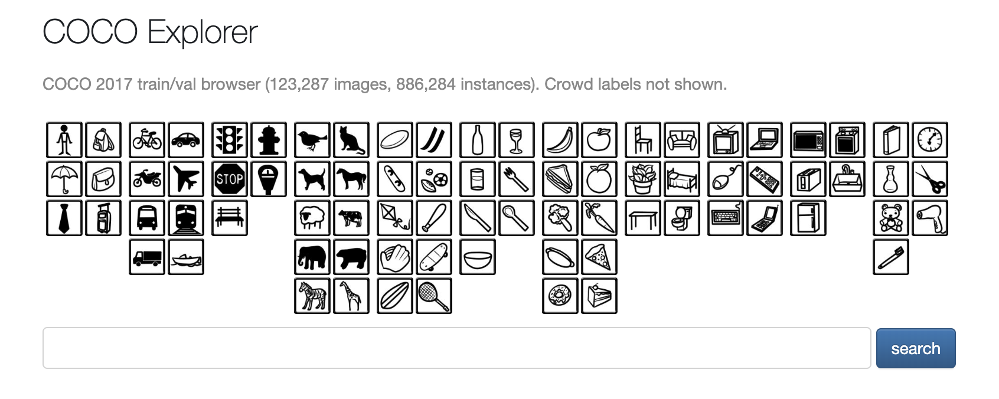

# 💾 Lab 4: 3D Object Detection and Depth Estimation with YOLO and Stereo Camera in ROS

## GitHub Repository



## Objectives

- To understand the integration of a stereo depth camera with ROS for 3D object detection.
- To learn to subscribe to and interpret the SpatialDetection ROS message that includes object hypotheses, bounding boxes, and 3D position data.
- To capture and analyze object detection data for specific COCO dataset classes, focusing on 'person' and another chosen class, within a real-world robotic context.
- To evaluate the accuracy of depth measurements provided by the stereo camera against known ground truth distances.
- To identify and discuss the potential sources of discrepancies between the detected and actual object positions, such as sensor limitations or environmental factors.

## Brief intro about YOLO 

YOLO (You Only Look Once) is a fast, accurate neural network-based object detection system that identifies and classifies objects in images in real-time. It is trained on the COCO dataset, which contains 80 diverse object categories ranging from people and vehicles to animals and everyday items. In practical setting, YOLO can be used to enable robots to detect objects within their field of vision and, when combined with depth data, ascertain the 3D position (XYZ coordinates) of each identified object. This capability is essential for a variety of robotic applications, including navigation, manipulation, and interaction with the environment.

In this ROS Lab, YOLO is integrated to perform object detection tasks within the OAK-D-Lite's environment. With additional processing, such as using depth sensing from the stereo camera, the system can estimate the x, y, and z coordinates of each detected object, effectively mapping them into the robot's 3D space.

### You can explore the cocodatset here:

https://cocodataset.org/#explore

## Data Analysis:

- Tabulate the position data for detected objects, noting the changes in the detected distances over time.
- Compare this data with the ground truth measurements of object distances from the camera.
- Identify any discrepancies between the measured and actual distances.

## Discussion:

- Reflect on the performance of the stereo camera and YOLO detection system.
- Discuss potential sources of error, such as the minimum detectable distance of the camera, calibration issues, or environmental interference.
- Suggest improvements or considerations for real-world applications.

## Conclusion:
Summarize the findings and their implications for the use of stereo cameras and object detection in robotic applications.

